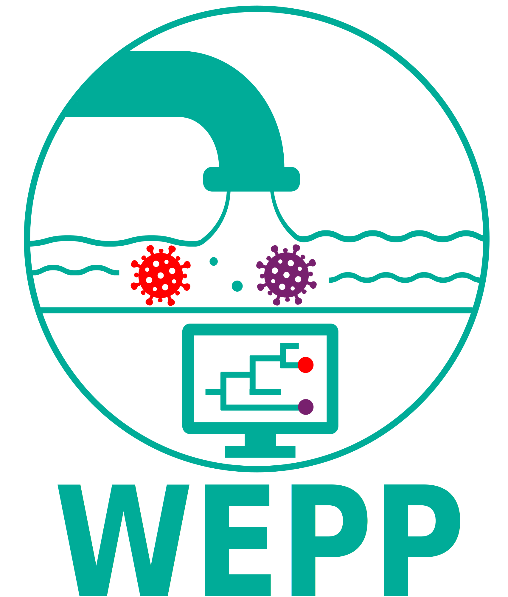

<p align="center">
  
</p>

<h1 align="center">
  Wastewater-based Epidemiology using Phylogenetic Placement
</h1>


## Installation (Follow steps 2-3 if you want to use docker)
1. `git clone --recurse-submodules https://github.com/TurakhiaLab/SARS2-WBE.git`. Switch the branch if needed and check if the `src/Freyja` is not empty. If it is empty then go inside `src/Freyja` and use
```
git pull --recurse 
```
2. Create a docker image by going to the `docker` and running,
```
docker build -t {image_name} .
```
3. Return to the main folder and run 
```
docker run -it -v "$PWD":/workspace -w /workspace {image_name} /bin/bash
```

## Running
We consider that all the reads belong to a `dataset` and all the files begin with a `file_prefix`.  
1. Place the reads under the `./data/{dataset}/` folder ending with the name `*R{1/2}.fastq.gz` for paired-ended reads and `*.fastq.gz` for single-ended.
2. Create a config/config.yaml file that contains the name of the PanMAT under the key "TREE". It should also be placed in the `./data/{dataset}` folder. Pick the primer bed file from the database folder. You can use `none.bed` file if you do not have any primers.
3. Run snakemake. Do not forget the --use-conda flag. Optionally, you can specific configuration options here instead.
```
snakemake ./results/{dataset}/{file_prefix}_run.txt --cores 16 --use-conda
```

**WEPP** is a novel phylogenetic method for detecting the SARS CoV-2 variants from the wastewater. Since, WEPP is based on a Phylogentic method, it can be used to detect the variants at the resolution of haplotypes. We have two version of WEPP - one is based on MAT called WEPP-MAT and the other uses PANMAT called WEPP-PANMAT.  

This repository contains the complete workflow, which requires the following inputs to generate results:
1. Sequencing reads in `fastq.gz` format
2. A phylogenetic tree in `PanMAT` format
3. A primer `BED` file
