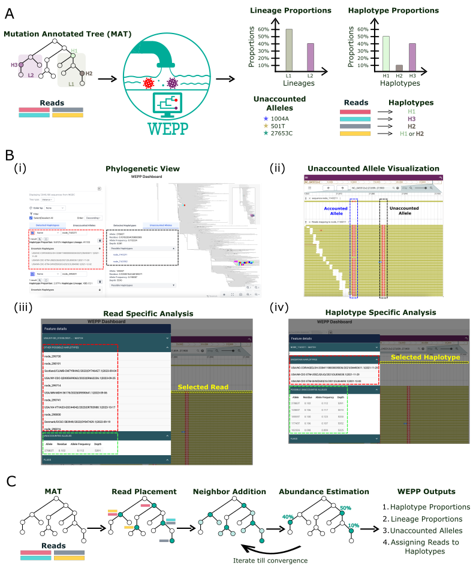

<div align="center">
    
# Wastewater-Based Epidemiology using Phylogenetic Placements

[license-badge]: https://img.shields.io/badge/License-MIT-yellow.svg 
[license-link]: https://github.com/TurakhiaLab/WEPP/blob/main/LICENSE

[![License][license-badge]][license-link]
[](https://cmake.org)
[](https://snakemake.readthedocs.io/en/v7.19.1/index.html)

<div align="center">
  
</div>

</div>

## Table of Contents
- [Introduction](#intro) ([Wiki](https://turakhia.ucsd.edu/WEPP))
- [Installation](#install)
  - [Option-1: Install via Dockerfile](#docker)
  - [Option-2: Install via Shell Commands](#script)
- [Quick Start](#example)
- [User Guide](#guide)
  - [Organizing Data](#data)
  - [WEPP Arguments](#arguments)
  - [Run Command](#snakemake)
- [Contributions](#contribution)
- [Citing WEPP](#cite)

<br>


## <a name="intro"></a> Introduction

WEPP (**W**astewater-Based **E**pidemiology using **P**hylogenetic **P**lacements) is a phylogeny-based pipeline that estimates haplotype proportions from wastewater sequencing reads using a mutation-annotated tree (MAT) (Figure 1A). By improving the resolution of pathogen variant detection, WEPP enables critical epidemiological applications previously feasible only through clinical sequencing. It also flags potential novel variants via unaccounted mutations, which can be examined at the read level using the interactive dashboard (Figure 1C).

WEPP’s algorithm begins with parsimonious placement of all reads onto the MAT, followed by identifying candidate haplotype nodes, or “Peaks” (Figure 1B). This set is expanded with neighboring haplotypes of selected Peaks to form a candidate pool, which is passed to a deconvolution algorithm to estimate haplotype abundances. This pool is iteratively refined by retaining haplotypes above a threshold and adding their neighbors until convergence.


<div align="center">
    
    <div><b>Figure 1: Overview of WEPP</b></div>
</div>


## <a name="install"></a> Installation
WEPP offers multiple installation methods. Using a [Docker](https://docs.docker.com/engine/install/) is recommended to prevent any conflict with existing packages.
1. Dockerfile 
2. Shell Commands 

### <a name="docker"></a> Option-1: Install via Dockerfile
The Dockerfile contains all dependencies required to run WEPP.

**Step 1:** Clone the repository
```bash
git clone --recurse-submodules https://github.com/TurakhiaLab/WEPP.git 
cd WEPP
git checkout wepp_em
```
**Step 2:** Build a Docker Image
```bash
cd docker
docker build -t wepp . 
cd ..
```
**Step 3:** Start and run Docker container
```bash
# Use this command if your datasets can be downloaded from the Web
docker run -it wepp

# Use this command if your datasets are present in your current directory
docker run -it -v "$PWD":/workspace -w /workspace wepp
```

### <a name="script"></a> Option-2: Install via Shell Commands (requires sudo access if certain common libraries are not already installed)  

Users without sudo access are advised to install WEPP via [Docker](#docker).

**Step 1:** Clone the repository
```bash
git clone --recurse-submodules https://github.com/TurakhiaLab/WEPP.git
cd WEPP
git checkout wepp_em
```
**Step 2:** Install dependencies (might require sudo access)
WEPP depends on the following common system libraries, which are typically pre-installed on most development environments:
```text
- wget
- curl
- pip
- build-essential 
- python3-pandas
- pkg-config
- zip
- cmake 
- libtbb-dev
- libprotobuf-dev
- protobuf-compiler
- snakemake
- conda
```

For Ubuntu users with sudo access, if any of the required libraries are missing, you can install them with:
```bash
sudo apt-get install -y wget pip curl python3-pip build-essential python3-pandas pkg-config zip cmake libtbb-dev libprotobuf-dev protobuf-compiler snakemake
```

If your system doesn't have Conda, you can install it with:
```bash
wget -O Miniforge3.sh "https://github.com/conda-forge/miniforge/releases/download/24.11.3-2/Miniforge3-24.11.3-2-Linux-x86_64.sh"
bash Miniforge3.sh -b -p "${HOME}/conda"

source "${HOME}/conda/etc/profile.d/conda.sh"
source "${HOME}/conda/etc/profile.d/mamba.sh"
```

##  <a name="example"></a> Quick Start
The following steps will download a real wastewater RSVA dataset and analyze it with WEPP.

**Step 1:** Download the test dataset
```bash
mkdir -p data/RSVA_real
cd data/RSVA_real
wget ftp://ftp.sra.ebi.ac.uk/vol1/fastq/ERR147/011/ERR14763711/ERR14763711_*.fastq.gz https://hgdownload.gi.ucsc.edu/hubs/GCF/002/815/475/GCF_002815475.1/UShER_RSV-A/2025/04/25/rsvA.2025-04-25.pb.gz https://ftp.ncbi.nlm.nih.gov/genomes/all/GCF/002/815/475/GCF_002815475.1_ASM281547v1/GCF_002815475.1_ASM281547v1_genomic.fna.gz
gunzip GCF_002815475.1_ASM281547v1_genomic.fna.gz 
mv ERR14763711_1.fastq.gz ERR14763711_R1.fastq.gz
mv ERR14763711_2.fastq.gz ERR14763711_R2.fastq.gz
cd ../../
```
This will save the datasets on a separate data/RSVA_real folder within the repository.

**Step 2:**  Run the pipeline
```bash
snakemake --config DIR=RSVA_real FILE_PREFIX=test_run PRIMER_BED=RSVA_all_primers_best_hits.bed TREE=rsvA.2025-04-25.pb.gz REF=GCF_002815475.1_ASM281547v1_genomic.fna CLADE_IDX=0 --cores 32 --use-conda
```

**Step 3:**  Analyze Results

All results generated by WEPP can be found in the `results/RSVA_real` directory.

## <a name="guide"></a> User Guide
### <a name="data"></a> Organizing Data
We assume that all wastewater samples are organized in the `data` directory, each within its own subdirectory given by `DIR` argument (see Run Command). For each sample, WEPP generates intermediate and output files in corresponding subdirectories under `intermediate` and `result`, respectively. 
Each created `DIR` inside `data` is expected to contain the following files:
1. Sequencing Reads: Ending with `*R{1/2}.fastq.gz` for paired-ended reads and `*.fastq.gz` for single-ended.
2. Reference Genome fasta
3. Mutation-Annotated Tree (MAT)
4. [OPTIONAL] Genome Masking File: `mask.bed`, whose third column specifies sites to be excluded from analysis.

Visualization of WEPP's workflow directories
```text
📁 WEPP
└───📁data                                # [User Created] Contains data to analyze 
    ├───📁SARS-CoV-2_test_1               # SARS-CoV-2 run wastewater samples
         ├───sars_cov_2_reads.fastq.gz    # Single-ended reads 
         ├───sars_cov_2_reference.fa
         ├───mask.bed                     # OPTIONAL 
         └───sars_cov_2_mat.pb.gz
    ├────📁RSVA_test_1                    # RSVA run wastewater samples 
         ├───rsva_reads_R1.fastq.gz       # Paired-ended reads
         ├───rsva_reads_R2.fastq.gz       # Paired-ended reads
         ├───rsva_reference.fa 
         └───rsva_mat.pb.gz

└───📁intermediate                        # [WEPP Generated] Contains intermediate stage files 
    ├───📁SARS-CoV-2_test_1                
         ├───file_1
         └───file_2
    ├────📁RSVA_test_1                      
         ├───file_1
         └───file_2

└───📁results                             # [WEPP Generated] Contains final WEPP results
    ├───📁SARS-CoV-2_test_1                
         ├───file_1
         └───file_2
    ├────📁RSVA_test_1                      
         ├───file_1
         └───file_2
```

### <a name="arguments"></a> WEPP Arguments
The WEPP Snakemake pipeline requires the following arguments, which can be provided either via the configuration file (`config/config.yaml`) or passed directly on the command line using the `--config` argument. The command line arguments take precedence over the config file.
1. `DIR` - Folder name containing the wastewater reads
2. `FILE_PREFIX` - File Prefix for all intermediate files 
3. `REF` - Reference Genome in fasta
4. `TREE` - Mutation-Annotated Tree
5. `SEQUENCING_TYPE` - Sequencing read type (s:Illumina single-ended, d:Illumina double-ended, or n:ONT long reads)
6. `PRIMER_BED` - BED file for primers from the `primers` folder
7. `MIN_AF` - Alleles with an allele frequency below this threshold in the reads will be masked. 
8. `MIN_Q` - Alleles with a Phred score below this threshold in the reads will be masked.
9. `MAX_READS` - Maximum number of reads considered by WEPP from the sample. Helpful for reducing runtime
10. `CLADE_IDX` - Index used for assigning clades to selected haplotypes from MAT. Generally '1' for SARS-CoV-2 MATs and '0' for others. Could be checked by running: "matUtils summary -i {TREE} -C {FILENAME}" -> Use '0' for annotation_1 and '1' for annotation_2 

### <a name="snakemake"></a> Run Command
WEPP's snakemake workflow requires `DIR` and `FILE_PREFIX` as config arguments through the command line, while the remaining ones can be taken from the config file. It also requires `--cores` from the command line, which specifies the number of threads used by the workflow.

Examples:
1. Using all the parameters from the config file
```bash
snakemake --config DIR=SARS-CoV-2_test_1 FILE_PREFIX=test_run --cores 32 --use-conda
```

2. Overriding MIN_Q and PRIMER_BED through command line
```bash
snakemake --config DIR=RSVA_test_1 FILE_PREFIX=test_run MIN_Q=25 PRIMER_BED=none.bed --cores 32 --use-conda
```

##  <a name="contribution"></a> Contributions
We welcome contributions from the community to enhance the capabilities of **WEPP**. If you encounter any issues or have suggestions for improvement, please open an issue on [WEPP GitHub page](https://github.com/TurakhiaLab/WEPP). For general inquiries and support, reach out to our team.

##  <a name="cite"></a> Citing WEPP
TBA.
