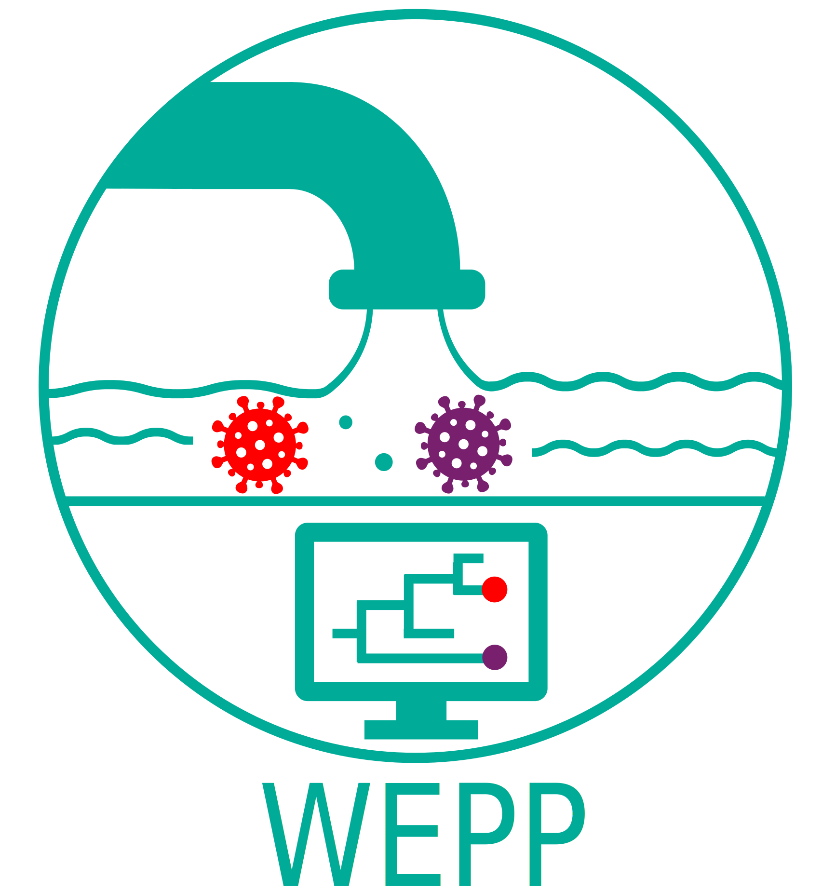

<div align="center">
    
# Wastewater-Based Epidemiology using Phylogenetic Placements

[license-badge]: https://img.shields.io/badge/License-MIT-yellow.svg 
[license-link]: https://github.com/TurakhiaLab/WEPP/blob/main/LICENSE

[![License][license-badge]][license-link]
[](https://cmake.org)
[](https://snakemake.readthedocs.io/en/v7.19.1/index.html)

<div align="center">
  
</div>

</div>

## Table of Contents
- [Introduction](#intro) ([Wiki](https://turakhia.ucsd.edu/WEPP))
- [Installation](#install)
  - [Summary](#summary) 
  - [Using Install Script](#script)
  - [Using Dockerfile](#docker)
- [Running WEPP](#running)
  - [Organizing Data](#data)
  - [WEPP Arguments](#arguments)
  - [Run Command](#snakemake)
- [Contributions](#contribution)
- [Citing WEPP](#cite)

<br>


## <a name="intro"></a> Introduction

WEPP (**W**astewater-Based **E**pidemiology using **P**hylogenetic **P**lacements)  is a phylogeny-based pipeline that detects the set of haplotypes, along with their estimated proportions, that best explain a given wastewater sample (Figure 1A). It processes raw wastewater sequencing reads and a mutation-annotated tree (MAT) containing clinical sequences of the pathogen being analyzed. The pipeline reports lineage abundances, unaccounted alleles, and parsimonious read-to-haplotype mappings—all of which can be explored through an interactive, user-friendly dashboard (Figure 1C).By enabling haplotype-level resolution within the context of a comprehensive global phylogeny built from clinical sequencing data, WEPP extends the capabilities of wastewater-based epidemiology (WBE) to a broader range of applications. These include: (i) detecting intra-lineage clusters circulating within the local catchment area, (ii) inferring introductions of new transmission clusters across regions, (iii) identifying unaccounted alleles that may signal emerging variants, and (iv) performing detailed read-level analysis of wastewater samples.

Figure 1B shows that WEPP starts by placing raw sequencing reads parsimoniously onto the mutation-annotated tree (MAT). It then scores and selects a subset of nodes and their neighboring haplotypes to create an initial candidate pool. This candidate pool is then passed to a deconvolution algorithm, based on Freyja to estimate the relative abundance of each haplotype, and iteratively refines the candidate set. In each iteration, a new candidate pool is constructed from haplotypes above a frequency threshold and their respective neighbors, followed by another round of deconvolution. This process repeats until convergence or until a maximum number of iterations is reached. Finally, WEPP uses an outlier detection algorithm on the residue of the deconvolution algorithm to detect unaccouned alleles–—mutations with large discrepancies between observed and expected frequencies.


<div align="center">
    <div><b>Figure 1: Overview of WEPP alogorithm</b></div>
    
</div>


## <a name="install"></a> Installation
### <a name="summary"></a> Summary (Select your installation method)

WEPP offers multiple installation methods:
- Install script for directly WEPP running on your system
- Docker (built from the provided Dockerfile) is recommended to prevents any conflict with existing packages

### <a name="script"></a> Using installation script (requires sudo access if certain common libraries are not already installed)  

Users without sudo access are advised to install WEPP via [Docker](#docker).

**Step 1:** Clone the repository
```bash
git clone --recurse-submodules https://github.com/TurakhiaLab/WEPP.git
cd WEPP
```
**Step 2:** Install dependencies (might require sudo access)
WEPP depends on the following common system libraries, which are typically pre-installed on most development environments:
```bash
- wget
- curl
- pip
- build-essential 
- python3-pandas
- pkg-config
- zip
- cmake 
- libtbb-dev
- libprotobuf-dev
- protobuf-compiler
- snakemake
- conda
```

For Ubuntu users with sudo access, if any of the required libraries are missing, you can install them with:
```bash
sudo apt-get install -y wget pip curl python3-pip build-essential python3-pandas pkg-config zip cmake libtbb-dev libprotobuf-dev protobuf-compiler snakemake
```

If your system doesn't have Conda, you can install it with:
```bash
wget https://repo.anaconda.com/miniconda/Miniconda3-latest-Linux-x86_64.sh
chmod +x Miniconda3-latest-Linux-x86_64.sh
./Miniconda3-latest-Linux-x86_64.sh

export PATH="$HOME/miniconda3/bin:$PATH"
source ~/.bashrc
```

### <a name="docker"></a> Using Dockerfile
The Dockerfile installs all the dependencies and tools for WEPP. 

**Step 1:** Clone the repository
```bash
git clone --recurse-submodules https://github.com/TurakhiaLab/WEPP.git
cd WEPP
```
**Step 2:** Build a docker image (ensure Docker is installed first)
```
cd docker
docker build -t wepp .
cd ..
```
**Step 3:** Start and run docker container
```
docker run -it -v "$PWD":/workspace -w /workspace wepp /bin/bash
```

## <a name="running"></a> Running WEPP
### <a name="data"></a> Organizing Data
We assume that all wastewater samples are organized in the `data` directory, each within its own subdirectory given by `DIR` argument (see Run Command(#snakemake)). For each sample, WEPP generates intermediate and output files in corresponding subdirectories under `intermediate` and `result`, respectively. 
Each created `DIR` inside `data` is expected to contain the following files:
1. Sequencing Reads: Ending with `*R{1/2}.fastq.gz` for paired-ended reads and `*.fastq.gz` for single-ended.
2. Reference Genome fasta
3. Mutation-Annotated Tree (MAT)
4. [OPTIONAL] Genome Masking File: `mask.bed` whose third column specifies sites to be excluded from analysis.

Visualization of WEPP's workflow structure
```text
📁 WEPP
└───📁data                                # Contains data to run [User Created]
    ├───📁SARS-CoV-2_test_1               # SARS-CoV-2 run wastewater samples
         ├───sars_cov_2_reads.fastq.gz    # Single-ended reads 
         ├───sars_cov_2_reference.fa
         ├───mask.bed                     # OPTIONAL 
         └───sars_cov_2_mat.pb.gz
    ├────📁RSVA_test_1                    # RSVA run wastewater samples 
         ├───rsva_reads_R1.fastq.gz       # Paired-ended reads
         ├───rsva_reads_R2.fastq.gz       # Paired-ended reads
         ├───rsva_reference.fa 
         └───rsva_mat.pb.gz

└───📁intermediate                        # Contains files generated by WEPP [WEPP Generated]
    ├───📁SARS-CoV-2_test_1                
         ├───file_1
         └───file_2
    ├────📁RSVA_test_1                      
         ├───file_1
         └───file_2

└───📁results                             # Contains WEPP results [WEPP Generated]
    ├───📁SARS-CoV-2_test_1                
         ├───file_1
         └───file_2
    ├────📁RSVA_test_1                      
         ├───file_1
         └───file_2
```

### <a name="arguments"></a> WEPP Arguments
The WEPP Snakemake pipeline requires the following arguments, which can be provided either via the configuration file (`config/config.yaml`) or passed directly on the command line using the `--config` argument. The command line arguments take precedence over the config file.
1. `DIR` - Folder name containing the wastewater reads
2. `FILE_PREFIX` - File Prefix for all intermediate files 
3. `REF` - Reference Genome in fasta
4. `TREE` - Mutation-Annotated Tree
5. `SEQUENCING_TYPE` - Sequencing read type (s:Illumina single-ended, d:Illumina double-ended, or n:ONT long reads)
6. `PRIMER_BED` - BED file for primers from the `primers` folder
7. `MIN_AF` - Alleles with an allele frequency below this threshold in the reads will be masked. 
8. `MIN_Q` - Alleles with a Phred score below this threshold in the reads will be masked.
9. `MAX_READS` - Maximum number of reads considered by WEPP from the sample. Helpful for reducing runtime
10. `CLADE_IDX` - Index used for assigning clades to selected haplotypes from MAT. Generally '1' for SARS-CoV-2 MATs and '0' for others. Could be checked by running: "matUtils summary -i {TREE} -C {FILENAME}" -> Use '0' for annotation_1 and '1' for annotation_2 

### <a name="snakemake"></a> Run Command
WEPP's snakemake workflow requires `DIR` and `FILE_PREFIX` config arguments through the command line, while the remaining ones can be taken from the config file. It also requires `--cores` from the command line, which specified the number of threads used by the workflow.
Examples:
1. Using all the parameters from the config file
```
snakemake --config DIR=SARS-CoV-2_test_1 FILE_PREFIX=test_run --cores 32 --use-conda
```

2. Overriding MIN_Q and PRIMER_BED through command line
```
snakemake --config DIR=RSVA_test_1 FILE_PREFIX=test_run MIN_Q=25 PRIMER_BED=none.bed --cores 32 --use-conda
```

##  <a name="contribution"></a> Contributions
We welcome contributions from the community to enhance the capabilities of **WEPP**. If you encounter any issues or have suggestions for improvement, please open an issue on [WEPP GitHub page](https://github.com/TurakhiaLab/WEPP). For general inquiries and support, reach out to our team.

##  <a name="cite"></a> Citing WEPP
TBA.